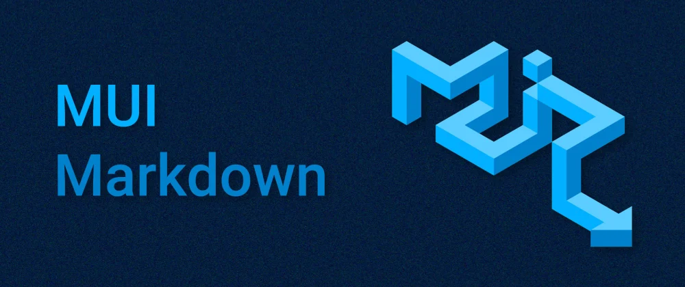

## About

`mui-markdown` uses [markdown-to-jsx](https://github.com/probablyup/markdown-to-jsx) and [MUI(formerly material-ui)](https://github.com/mui-org/material-ui) to help you render MD/MDX files with MUI components.

Using `mui-markdown`:

- Markdown components will adapt to theme automatically
- Optional Syntax Highlight Support using `prism-react-renderer`
- Optional Diagrams Support using `mermaid`

## User Guide

### Installation

```bash
# with npm
npm i mui-markdown@latest

# with yarn
yarn add mui-markdown
```

### Usage

The example below will render the `h1` tag using MUI `Typography` component.

```js
import React from 'react';
import { MuiMarkdown } from 'mui-markdown';
// You can also use
// import MuiMarkdown from 'mui-markdown';
// But the first approach is recommended.

const App = () => {
  return <MuiMarkdown>{`# Hello markdown!`}</MuiMarkdown>;
};

export default App;
```

### Props

Props available for `MuiMarkdown` component:

| Name              | Type                    | Default          | Optional or Mandatory |
| ----------------- | ----------------------- | ---------------- | --------------------- |
| key               | React.key               | -                | **optional**          |
| children          | string                  | -                | **optional**          |
| overrides         | MarkdownToJSX.Overrides | defaultOverrides | **optional**          |
| options           | MarkdownToJSX.Options   | -                | **optional**          |
| codeWrapperStyles | CSSProperties           | -                | **optional**          |
| prismTheme        | PrismTheme              | vsDark           | **optional**          |
| Highlight         | HighlightComponent      | -                | **optional**          |
| themes            | HighlightThemes         | -                | **optional**          |
| hideLineNumbers   | boolean                 | false            | **optional**          |
| enableMermaid     | boolean                 | false            | **optional**          |
| mermaidConfig     | MermaidConfig           | -                | **optional**          |

**NOTE:** You cannot use overrides and options at the same time.

### overrides

You can optionally override a tag to use your component.

**An example of override with a regular HTML tag:**

JS and JSX:

```jsx
import React from 'react';
import { MuiMarkdown, defaultOverrides } from 'mui-markdown';

const App = () => {
  return (
    <MuiMarkdown
      overrides={{
        ...defaultOverrides, // This will keep the other default overrides.
        h1: {
          component: 'p',
          props: {
            style: { color: 'red' },
          },
        },
      }}
    >
      {`# Hello markdown!`}
    </MuiMarkdown>
  );
};

export default App;
```

TS and TSX:

```tsx
import React from 'react';
import { MuiMarkdown, defaultOverrides } from 'mui-markdown';

const App = () => {
  return (
    <MuiMarkdown
      overrides={{
        ...defaultOverrides, // This will keep the other default overrides.
        h1: {
          component: 'p',
          props: {
            style: { color: 'red' },
          } as React.HTMLProps<HTMLParagraphElement>,
        },
      }}
    >
      {`# Hello markdown!`}
    </MuiMarkdown>
  );
};

export default App;
```

**An example of override with your component:**

JS and JSX:

```jsx
import React from 'react';
import { MuiMarkdown, defaultOverrides } from 'mui-markdown';
import CustomTypography from './components/CustomTypography';

const App = () => {
  return (
    <MuiMarkdown
      overrides={{
        ...defaultOverrides, // This will keep the other default overrides.
        h1: {
          component: CustomTypography,
          props: {
            // custom props
          },
        },
      }}
    >
      {`# Hello markdown!`}
    </MuiMarkdown>
  );
};

export default App;
```

TS and TSX:

```tsx
import React from 'react';
import { MuiMarkdown, defaultOverrides } from 'mui-markdown';
import CustomTypography, {
  CustomTypographyProps,
} from './components/CustomTypography';

const App = () => {
  return (
    <MuiMarkdown
      overrides={{
        ...defaultOverrides, // This will keep the other default overrides.
        h1: {
          component: CustomTypography,
          props: {
            // custom props
          } as CustomTypographyProps,
        },
      }}
    >
      {`# Hello markdown!`}
    </MuiMarkdown>
  );
};

export default App;
```

### options

You can read about options in the [markdown-to-jsx](https://www.npmjs.com/package/markdown-to-jsx#parsing-options) docs.

**Note:** If you want to override something and also need to set some options, add the `overrides` property in the `options`. Don't use overrides and options property together on the `MuiMarkdown` component.

### codeWrapperStyles

You can pass your desired styles for the syntax highlighter component. These are the default styles:

```tsx
  ...
  borderRadius: '0.5rem',
  padding: '0.5rem 0.75rem',
  overflow: 'auto',
  ...
```

### Syntax Highlight

`mui-markdown` uses [prism-react-renderer](https://github.com/FormidableLabs/prism-react-renderer) to highlight code blocks. As this is an optional dependencies, you need to install it if you want to have a syntax highlighter. So to highlight your code:

- First install `prism-react-renderer`

```bash
# with npm
npm i prism-react-renderer

# with yarn
yarn add prism-react-renderer
```

- Then pass the `Highlight` and the `themes` to the `MuiMarkdown` component

```tsx
import React from 'react';
import { MuiMarkdown } from 'mui-markdown';
import { Highlight, themes } from 'prism-react-renderer';

const App = () => {
  return (
    <MuiMarkdown
      Highlight={Highlight}
      themes={themes}
      prismTheme={themes.github}
    >
      {`# Hello markdown!`}
    </MuiMarkdown>
  );
};

export default App;
```

With the `prismTheme` property you can change the highlight theme.

```tsx
import React from 'react';
import { MuiMarkdown } from 'mui-markdown';
import { Highlight, themes } from 'prism-react-renderer';

const App = () => {
  return (
    <MuiMarkdown
      Highlight={Highlight}
      themes={themes}
      prismTheme={themes.github}
    >
      {`# Hello markdown!`}
    </MuiMarkdown>
  );
};

export default App;
```

Also to disable the line numbers in the code block you can use the `hideLineNumbers`.

```tsx
import React from 'react';
import { MuiMarkdown } from 'mui-markdown';
import { Highlight, themes } from 'prism-react-renderer';

const App = () => {
  return (
    <MuiMarkdown
      Highlight={Highlight}
      themes={themes}
      prismTheme={themes.github}
      hideLineNumbers
    >
      {`# Hello markdown!`}
    </MuiMarkdown>
  );
};

export default App;
```

When you use overrides, you can have the syntax highlight by passing the `Highlight`, `themes`, and `themes.github` (or your favorite one) to the `getOverrides` function.

```tsx
import React from 'react';
import { MuiMarkdown, getOverrides } from 'mui-markdown';
import { Highlight, themes } from 'prism-react-renderer';

const App = () => {
  return (
    <MuiMarkdown
      overrides={{
        ...getOverrides({ Highlight, themes, theme: themes.github }), // This will keep the other default overrides.
        h1: {
          component: 'p',
          props: {
            style: { color: 'red' },
          },
        },
      }}
    >
      {`# Hello markdown!`}
    </MuiMarkdown>
  );
};

export default App;
```

## Diagram Support

`mui-markdown` uses [`mermaid`](https://github.com/mermaid-js/mermaid) as its diagramming and charting tool, to enable that, first make sure you have the `mermaid` installed. By passing the `enableMermaid` key you'll be able to have diagram support in you markdowns. Also, using the `mermaidConfigs` you can configure it as you like.

```tsx
...
      <MuiMarkdown enableMermaid mermaidConfig={{startOnLoad: true}} >
        {/* Markdown content */}
      </MuiMarkdown>
...
```

## NextJS

### Use with `useMDXComponents`

To add `mui-markdown` to `useMDXComponents` you can either import `defaultMdxComponents` or use `getMdxComponents` if you need to override defaults.

```ts
import type { MDXComponents } from 'mdx/types';

import { defaultMdxComponents, getMdxComponents } from 'mui-markdown';

// You can use the getMdxComponents(options) to override defaults!
// const mdxComponents = getMdxComponents();

export function useMDXComponents(components: MDXComponents): MDXComponents {
  return {
    // ...mdxComponents,
    ...defaultMdxComponents,
    ...components,
  };
}
```
